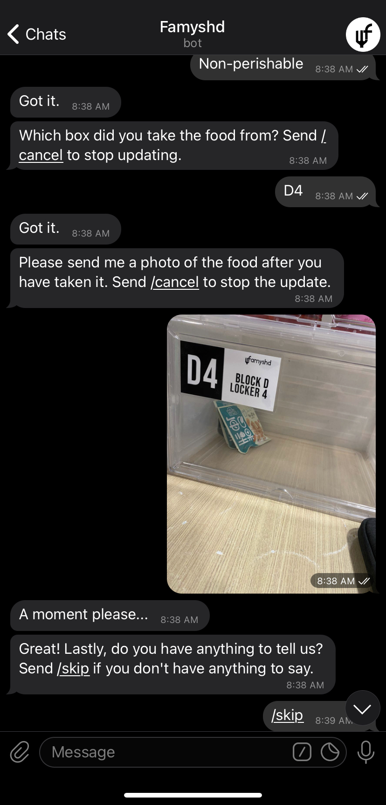

# Famyshd

### Are you FAMYSHD? Not me!

- Household food wastage is a prevalent issue in Singapore, mainly generated from leftovers and food that have gone spoiled or expired.

- Famyshd is a Telegram Bot deployed on Heroku. It aims to reduce food waste that people can easily share food instead of disposing of them. 

- People only need to  
  - Step 1: Access the bot on Telegram  
  - Step 2: Add the location, type of food, and a picture of the food they’re sharing
  - The bot will then send this message directly to the Famyshd Channel anonymously.

- If other users want the food, they can go to the station, grab the food, and update the status of the food via the bot as well. 

- In essence, it's a simple and efficient way for people to share food anonymously. 
 
